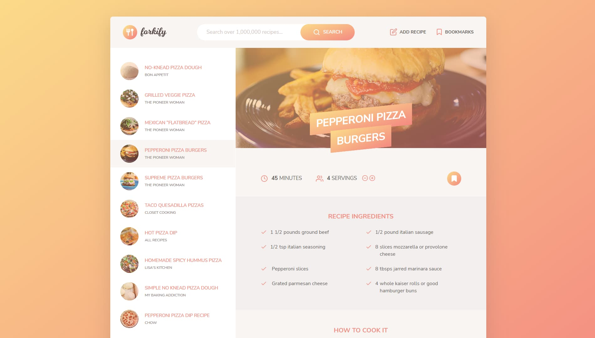

# Forkify

[Demo](https://deniskulik.github.io/forkify/)

## Description

Forkify is a vanilla JavaScript application that interacts with the Forkify API to fetch and display food recipe data. The user can search for a specific recipe and save it in the favorites list, as well as create a new recipe. The user can easily increase or decrease portions according to their needs and view detailed instructions.

## Screenshots

## Built With

This app is built with pure vanilla JavaScript along with HTML and SCSS. It uses Webpack as module bundler and NPM as package manager.

## Getting started

1. Clone Repository
2. `cd forkify`
3. `npm i`
4. `npm run start`
